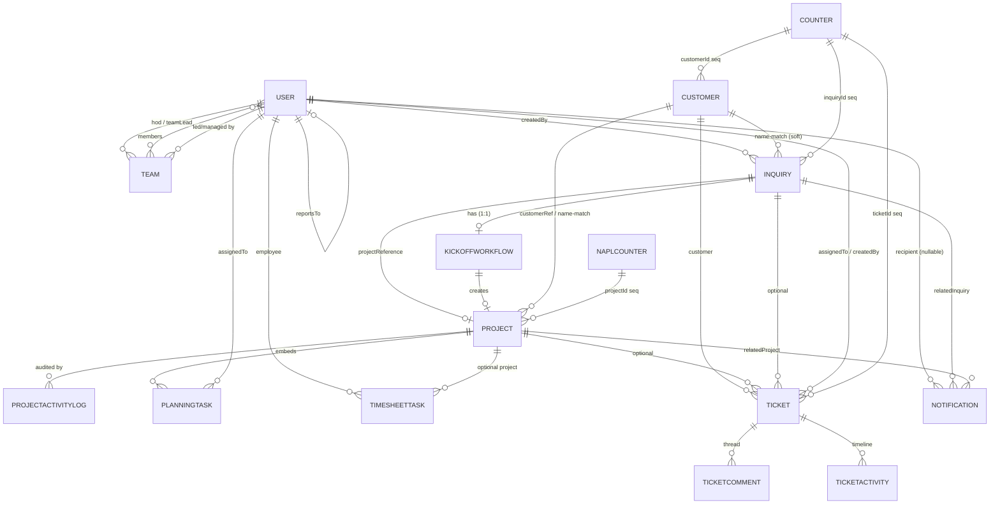
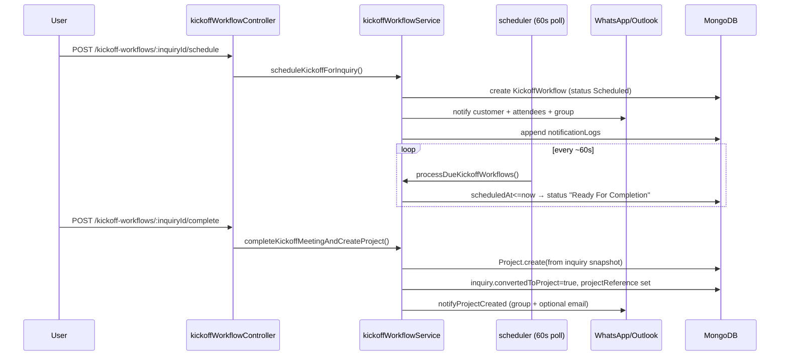
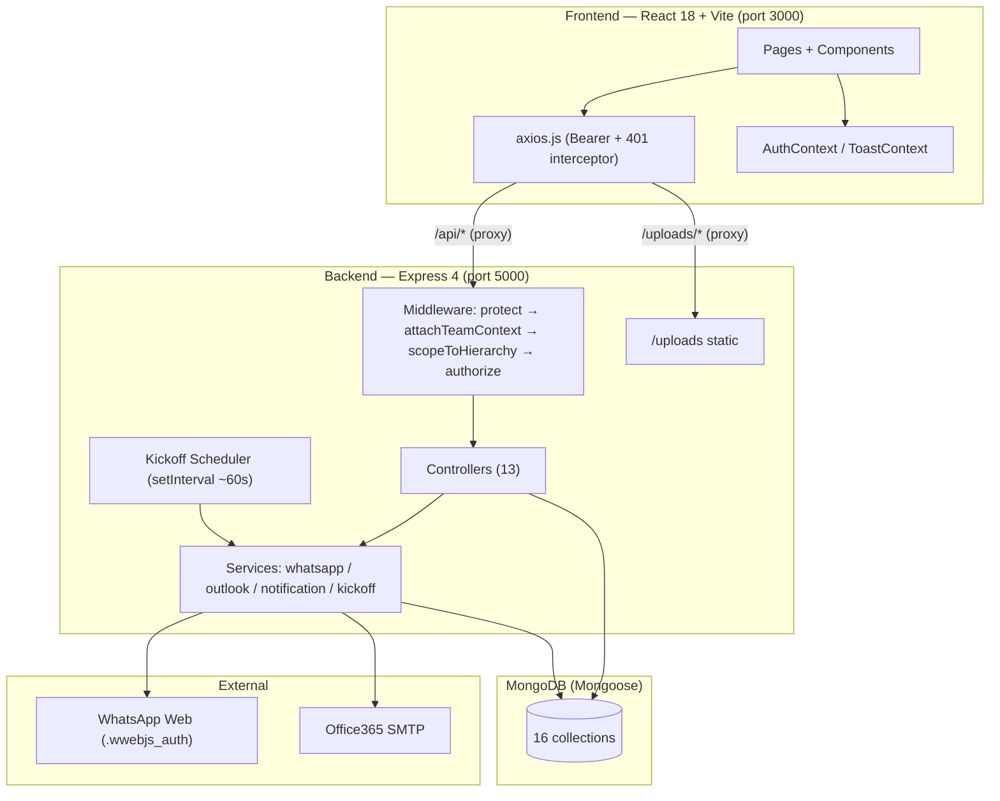
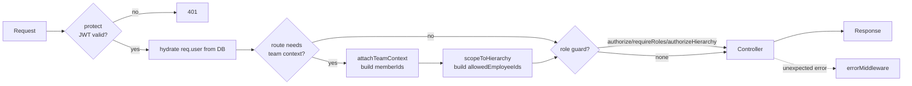

# Nexus Dashboard — Project Understanding Document

> **Phase:** 1 — Understanding only (no implementation)
> **Prepared by:** Senior Software Architect / Technical Analyst
> **Source of truth:** Actual source code in `nexus-dashboard.zip`, cross-checked against the project documentation. Where the two disagree, the **code wins** and the discrepancy is called out.
> **Scope:** Full-stack React + Node/Express + MongoDB CRM for an electrical-panel manufacturer (Nexus Automech).
> **Revision note:** This pass re-verified the codebase against the prior version of this document and updated it for: the new **Department Master** module, the new **Integration Settings** (WhatsApp QR + Email/SMTP) admin console, the reworked **Inquiry status/BOM workflow**, the **Order Won → Kick-off-only project creation** change, **Project panel-type normalization**, the removal of kickoff-attendee restrictions on planning-task assignment, the **personal WhatsApp assignment message**, and the new **Timesheet ↔ Project reverse sync**. Sections not called out as updated were re-checked and found unchanged from the prior pass.

A note on method: every file path, function name, route, enum, and field below was read directly from the codebase. Where I write "verified," it means I traced the reference. The shipped documentation under-describes the system — it omits the **Tickets (service desk)** module, the **Kickoff Workflow automation engine**, the **Department Master**, and **Integration Settings** entirely, and it mis-describes the project-delay model, the email integration, and the inquiry status/BOM workflow. Those corrections are flagged inline.

---

## 1. Executive Summary

### What this application does
Nexus Dashboard is an **internal CRM + operations platform** for an electrical switchgear/panel manufacturing company. It runs the full commercial-to-production lifecycle:

```
Inquiry intake → Quotation/commercial discussion → Order received
   → Kick-off meeting → Project (production/programming) → Planning grid execution
   → Dispatch → Installation → Payment → (post-sale) Support tickets
```

It also layers two operational systems on top of that core flow: a **team-based timesheet/Kanban system** for tracking employee work, and a **service-desk ticketing system** for post-sale support, repair, and replacement.

### Primary business purpose
Give a single, role-aware system where the company can:
- Capture detailed technical inquiries for electrical panels (MCC, PCC, APFC, VFD, PLC, AMF, BUSDUCT, SMDB, MLDB, etc.).
- Convert won inquiries into production projects via a structured kick-off meeting, with an automated scheduler.
- Plan and track production at the task level (planning grids with dependencies, milestones, and delay calculation).
- Track employee effort (timesheets) under a four-tier reporting hierarchy.
- Run a support desk for repair/replacement and warranty handling.
- Push real-time operational alerts to a WhatsApp group and email, plus an in-app notification feed.

### Key stakeholders
| Stakeholder | Interest in the system |
|---|---|
| **Admin** (owners/IT) | Full control: users, teams, deletes, configuration. |
| **HOD (Head of Department)** | Oversight of all teams/data they manage. |
| **Team Lead** | Day-to-day management of one team's tasks and members. |
| **Employee / Engineer** | Logs own timesheet work, executes planning tasks, handles tickets. |
| **Sales / Estimation** | Inquiry capture, quotation tracking. |
| **Production / Automation / Design / QC / Purchase / Store-Dispatch** | Departments referenced in planning tasks and tickets. |
| **Customers** | Indirect — recipients of kick-off notifications and ticket updates. |

---

## 2. Technology Stack

### Frontend (`frontend/package.json`)
| Concern | Technology |
|---|---|
| Framework | React 18.2 |
| Build tool | Vite 5.4 |
| Routing | React Router DOM 6.21 (Outlet pattern, lazy routes) |
| Styling | Tailwind CSS 3.4 + PostCSS + Autoprefixer |
| Drag & drop | `@dnd-kit/core`, `@dnd-kit/sortable`, `@dnd-kit/utilities` (Kanban) |
| Calendar | `@fullcalendar/react` (+ daygrid/timegrid/interaction) **and** `react-big-calendar` (both present) |
| Charts | Recharts 2.10 |
| Icons | lucide-react 0.309 |
| HTTP | Axios 1.6 (instance in `src/api/axios.js`) |
| Dates | dayjs 1.11 |
| State | **No global store** — React Context only (`AuthContext`, `ToastContext`) + per-page `useEffect` fetching |

### Backend (`backend/package.json`)
| Concern | Technology |
|---|---|
| Runtime | Node.js (LTS) |
| HTTP framework | Express 4.18 |
| ODM | Mongoose 8.0 |
| Auth | jsonwebtoken 9.0 (HS256, 7-day expiry) + bcryptjs (12 salt rounds) |
| File uploads | multer 1.4.5-lts.1 |
| WhatsApp | whatsapp-web.js 1.34 (+ qrcode-terminal) |
| Email | nodemailer 8.0 (Outlook/Office365 SMTP) |
| Validation | express-validator 7 (declared; lightly used) |
| Logging | morgan (dev only) |
| CORS | cors (open — `app.use(cors())` with no allowlist) |

### Database
- **MongoDB** (Atlas in production per docs; local fallback `mongodb://localhost:27017/electrical_crm` in `config/db.js`).
- Mongoose schemas, one model per collection.
- Human-readable IDs via a `Counter` collection (and a **separate** `NaplCounter` model for projects).

### Authentication
- Stateless JWT. Token in `localStorage` (frontend). `Authorization: Bearer <token>`.
- **No refresh-token mechanism.** 401 from the API triggers a hard logout + redirect in the axios response interceptor.

### Storage
- Local disk: `backend/uploads/inquiry/` (inquiry attachments) served statically at `/uploads/*`.
- Ticket attachments handled by multer (`ticketAttachmentUpload`).
- WhatsApp session persisted on disk in `backend/.wwebjs_auth/` and `.wwebjs_cache/`.

### External Services
- **WhatsApp Web** (group + individual messaging, with attachments).
- **Outlook/Office365 SMTP** (email notifications).
- That's it — no payment gateway, no Firebase, no Socket.IO (see §9).

---

## 3. Folder Structure Analysis

```
nexus-dashboard/
├── README.md                 # OUTDATED — describes an older, simpler app
├── backend/
│   ├── .env                  # ⚠ committed secrets (Mongo URI, JWT, Outlook, WhatsApp)
│   ├── .wwebjs_auth/         # WhatsApp session (runtime, persisted)
│   ├── .wwebjs_cache/        # WhatsApp cache (runtime)
│   ├── server.js             # Express app entry: middleware, route mounts, boots WhatsApp + scheduler
│   ├── config/
│   │   ├── db.js                         # Mongoose connection
│   │   └── projectPlanningTemplates.js   # Static planning-grid templates by panel type
│   ├── controllers/          # Business logic, one file per module (+ TicketActivity.js helper)
│   ├── middleware/
│   │   ├── authMiddleware.js             # protect, authorize, authorizeHierarchy
│   │   ├── permissionMiddleware.js       # requireRoles, attachTeamContext, scopeToHierarchy, canEditTask, canReadTask
│   │   └── errorMiddleware.js            # global error handler
│   ├── models/               # Mongoose schemas (13 model files)
│   ├── routes/               # Express routers (one per module) + testWhatsappRoute.js
│   ├── scripts/migrations/
│   │   └── 001_add_team_hierarchy.js     # one-time hierarchy migration
│   ├── seed/
│   │   ├── seedData.js                   # current seed (users/teams/etc.)
│   │   └── seedTask.js                   # timesheet task seed
│   ├── services/
│   │   ├── whatsappService.js            # whatsapp-web.js singleton + senders
│   │   ├── notificationService.js        # createNotification (+ optional Outlook email)
│   │   ├── outlookService.js             # nodemailer Office365 transport
│   │   ├── kickoffWorkflowService.js     # kick-off scheduling, notifications, auto project creation
│   │   ├── kickoffWorkflowScheduler.js   # setInterval poller for due kick-offs
│   │   └── documentExtractionService.js  # EMPTY placeholder (0 bytes)
│   ├── utils/
│   │   ├── generateToken.js              # JWT signer
│   │   ├── createNotification.js         # in-app-only notification helper (DUPLICATE of service)
│   │   └── departmentUtils.js            # department alias normalisation / matching
│   └── uploads/inquiry/                  # uploaded files (runtime)
└── frontend/
    ├── vite.config.js        # dev proxy: /api and /uploads → :5000
    ├── dist/                 # built output (committed)
    └── src/
        ├── main.jsx, App.jsx, index.css
        ├── api/              # axios.js, projectService.js, ticketService.js, timesheetService.js
        ├── components/
        │   ├── common/       # MainLayout, Sidebar, Topbar, Modal, Table, StatusBadge, Spinner,
        │   │                 # FormComponents.jsx, FormComponents.extended.jsx
        │   ├── activity/     # ActivityGraph, ProjectActivityLogHistory
        │   ├── inquiry/, customer/, project/, ticket/, timesheet/
        ├── context/          # AuthContext.jsx, ToastContext.jsx
        ├── data/             # masterData.js, projectPlanningTemplates.js (frontend copy)
        ├── layouts/MainLayout.jsx
        ├── pages/            # one per route (+ ProjectDetailPage, TimesheetCalendarPage = UNUSED)
        ├── routes/ProtectedRoute.jsx
        └── utils/            # calendarEventMapper.js, departmentUtils.js
```

**Major folder roles:**
- `backend/controllers` — all request handling and business rules. Big ones: `projectController.js` (1,543 lines), `ticketController.js` (1,589), `timesheetController.js` (885), `inquiryController.js` (714), `teamController.js` (636), `userController.js` (487).
- `backend/services` — side-effecting integrations (WhatsApp, email, notifications, kick-off automation). Controllers call into these.
- `backend/middleware` — the authorization spine. Almost all access control lives here, not in controllers (by design).
- `frontend/src/pages` — route-level screens. `frontend/src/components/timesheet` is the most complex feature folder (Kanban board, columns, sortable cards, three views, widgets, workload table, permission helper).

---

## 4. Module Inventory

| Module | Purpose | Backend files | Frontend files | Collections |
|---|---|---|---|---|
| **Auth** | Login, current user, password change | `controllers/authController.js`, `routes/authRoutes.js`, `middleware/authMiddleware.js`, `utils/generateToken.js` | `context/AuthContext.jsx`, `pages/LoginPage.jsx`, `routes/ProtectedRoute.jsx` | `users` |
| **Users** | Admin user CRUD + assignable-user lookup | `controllers/userController.js`, `routes/userRoutes.js` | `pages/UsersPage.jsx` | `users` |
| **Teams** | Org hierarchy (HOD/Lead/Members) | `controllers/teamController.js`, `routes/teamRoutes.js`, `models/Team.js`, `scripts/migrations/001_add_team_hierarchy.js` | (consumed by Timesheet UI) | `teams` |
| **Inquiries** | Technical inquiry capture + lifecycle | `controllers/inquiryController.js`, `routes/inquiryRoutes.js`, `models/Inquiry.js` | `pages/InquiriesPage.jsx`, `pages/ElectricalPanelInquiryPage.jsx`, `components/inquiry/InquiryForm.jsx` | `inquiries`, `counters` |
| **Customers** | Master customer records + history | `controllers/customerController.js`, `routes/customerRoutes.js`, `models/Customer.js` | `pages/CustomersPage.jsx`, `components/customer/CustomerForm.jsx` | `customers`, `counters` |
| **Projects** | Production order tracking + planning grid | `controllers/projectController.js`, `routes/projectRoutes.js`, `models/Project.js`, `models/ProjectActivityLog.js`, `config/projectPlanningTemplates.js` | `pages/ProjectsPage.jsx`, `components/project/ProjectForm.jsx`, `components/project/ProjectPlanningGrid.jsx`, `api/projectService.js`, `components/activity/*` | `projects`, `projectactivitylogs`, `naplcounters` |
| **Kick-off Workflow** | Schedule kick-off meeting → auto-create project | `controllers/kickoffWorkflowController.js`, `routes/kickoffWorkflowRoutes.js`, `models/KickoffWorkflow.js`, `services/kickoffWorkflowService.js`, `services/kickoffWorkflowScheduler.js` | (embedded in inquiry/project flows) | `kickoffworkflows` |
| **Timesheet** | Team-aware task tracking (List/Kanban/Calendar) | `controllers/timesheetController.js`, `routes/timesheetRoutes.js`, `models/TimesheetTask.js` | `pages/TimesheetPage.jsx`, `pages/TimesheetAdminPage.jsx`, `components/timesheet/*`, `api/timesheetService.js`, `utils/calendarEventMapper.js` | `timesheettasks` |
| **Tickets (Service Desk)** | Support / repair / replacement workflow | `controllers/ticketController.js`, `controllers/TicketActivity.js`, `routes/ticketRoutes.js`, `models/Ticket.js`, `models/TicketActivity.js`, `models/TicketComment.js` | `pages/TicketsPage.jsx`, `pages/TicketFormPage.jsx`, `pages/TicketViewPage.jsx`, `components/ticket/TicketForm.jsx`, `components/ticket/ticketPermissions.js`, `api/ticketService.js` | `tickets`, `ticketactivities`, `ticketcomments`, `counters` |
| **Notifications** | In-app notification feed | `controllers/notificationController.js`, `routes/notificationRoutes.js`, `models/Notification.js`, `services/notificationService.js`, `utils/createNotification.js` | `pages/NotificationsPage.jsx`, `components/common/Topbar.jsx` (bell) | `notifications` |
| **Dashboard** | KPIs + analytics | `controllers/dashboardController.js`, `routes/dashboardRoutes.js` | `pages/DashboardPage.jsx` | reads across all |
| **Department Master** *(new)* | Central department list; multiple HODs + one Team Lead per department; active/inactive state; drives User Management department assignment | `controllers/departmentController.js`, `routes/departmentRoutes.js`, `models/Department.js`, `services/departmentSeedService.js` | `pages/DepartmentPage.jsx`, `components/department/*` | `departments` |
| **Integration Settings** *(new)* | Admin console for the WhatsApp session (QR) and Email/SMTP credentials | `controllers/integrationController.js`, `routes/integrationRoutes.js`, `models/IntegrationSettings.js`, `services/emailSettingsService.js`, `services/whatsappService.js` (status/restart/logout) | `pages/IntegrationSettingsPage.jsx` | `integrationsettings` |
| **Diagnostics** | WhatsApp test endpoint | `routes/testWhatsappRoute.js` | — | — |

---

## 5. Database Analysis

### 5.1 Entities (collections)

1. **User** (`models/User.js`) — identity, role, department, team membership, reporting chain.
2. **Team** (`models/Team.js`) — join table for HOD → Team Lead → Members.
3. **Counter** (`models/Counter.js`) — shared sequence generator (`{ id, seq:default 1349 }`). IDs used: `customerId`, `inquiryId`, `ticketId`.
4. **NaplCounter** (defined **inline** inside `models/Project.js`, `_id:'napl'`, seq default 199) — project IDs only.
5. **Customer** (`models/Customer.js`) — `CUST-XXXX`.
6. **Inquiry** (`models/Inquiry.js`) — `INQ-<n>`; embeds `contacts[]`, `attachments[]`, `loadDetails[]`, `kickoffMeeting`.
7. **Project** (`models/Project.js`) — `NAPL-XXXX`; embeds `planningTasks[]`, `planningGrids[]`, `kickoffMeeting`, `sourceInquirySnapshot`.
8. **ProjectActivityLog** (`models/ProjectActivityLog.js`) — immutable project audit trail.
9. **KickoffWorkflow** (`models/KickoffWorkflow.js`) — one per inquiry (`unique`); drives automated kick-off → conversion.
10. **TimesheetTask** (`models/TimesheetTask.js`) — work entries powering List/Kanban/Calendar.
11. **Ticket** (`models/Ticket.js`) — `TKT-NNNNNN`; embeds `product`, `repairReplacement`, `attachments[]`.
12. **TicketActivity** (`models/TicketActivity.js`) — ticket audit timeline.
13. **TicketComment** (`models/TicketComment.js`) — ticket discussion thread (soft-deletable).
14. **Notification** (`models/Notification.js`) — in-app feed (user-targeted or global).
15. **Department** (`models/Department.js`) — central department master (`name`, `code` unique; `hods[]` + backward-compatible single `hod`; one `teamLead`; `isActive`). Seeded by `services/departmentSeedService.js` with: `ADMIN, SALES, ESTIMATION, DESIGN, AUTOMATION, PRODUCTION, PURCHASE, STORE, QC`.
16. **IntegrationSettings** (`models/IntegrationSettings.js`) — singleton document (`singletonKey:'default'`) holding the admin-managed Email/SMTP config (`isEnabled, provider, host, port, secure, username, fromEmail, passwordEncrypted [select:false], lastVerifiedAt, lastVerificationStatus, lastVerificationError`). WhatsApp has no persisted settings document — its live session/QR state is held in-memory by `whatsappService.js` and exposed via `getWhatsAppStatus()`.

### 5.2 Key field/enum facts (verified)

- **Inquiry.status** enum (current, corrected — supersedes prior documentation): `New, Technical Evaluation, Technical BOM Submission, BoM Submitted, Technical BOM Approval, Commercial BOM Submission, Order Won, Order Lost, Inquiry Hold, Revision`, plus legacy values still accepted for old records: `In Progress, Commercial Discussion, Commercial Submit, Technical Submit, Order Received, Order Recieved, Inquiry Lost, Inq. Lost, Quotation Submit`. `inquiryController.js` maps several legacy/incoming labels onto the new set (e.g. `'Technical Submit' → 'Technical BOM Submission'`, `'Commercial Submit'/'Commercial Discussion'/'Quotation Submit' → 'Commercial BOM Submission'`).
- **Inquiry BOM workflow (new):** Estimators upload BOM files via the `bomAttachments` multer field (max 10) on `PUT /api/inquiries/:id`. Each upload is appended to `inquiry.bomAttachments[]` with an auto-incrementing `revisionNumber` (`getNextBomRevisionNumber`: first submission is `0`, each subsequent upload is `previous max + 1`) and a `versionLabel` (`getBomVersionLabel`: revision `0` → `"Revision - 0"`, revision `N>0` → `"vN"`). **Any BOM upload automatically sets `inquiry.status = 'BoM Submitted'`** and writes a `statusDetails.bomSubmission` record (`revisionNumber`, `versionLabel`, `remarks`, `updatedBy`, `updatedAt`). There is no role restriction in the backend on who can view/download `bomAttachments` — they are returned as part of the normal inquiry payload, so Sales users see/download them on the same inquiry page as Estimation.
- **Inquiry.productType** enum (required): `MCC, PCC, APFC, VFD, PLC, OTHER, AMF, VFD_PANEL, PLC_PANEL, PLC_MCC, BUSDUCT, SMDB, MLDB`. The newer `panelTypes[]` (string array) and `inquiryType` enum (`PLC_AUTOMATION, VFD_PANEL, MCC_PANEL, MCC_CUM_PLC, LEGACY`) coexist with it and drive the Sprint-1 source-of-truth panel forms (PLC/Automation, VFD Panel, MCC Panel).
- **Inquiry → Project panel-type normalization (new):** `models/Project.js` exports `normalizeProjectPanelType()`, used as a Mongoose `set` transform on `Project.panelType`. It maps human-readable/inquiry labels onto the Project enum, e.g. `'PLC / Automation Panel'`, `'PLC Automation Panel'`, `'PLC Panel'`, `'PLC_AUTOMATION'` → `'PLC_PANEL'`; `'VFD_PANEL'`/`'VFD Panel'` → `'VFD_PANEL'`; `'MCC_PANEL'`/`'MCC Panel'` → `'MCC'`; `'MCC_CUM_PLC'`/`'MCC cum PLC Panel'`/`'MCC + PLC Panel'` → `'PLC_MCC'`. This prevents inquiry panel-type strings from failing Project's stricter enum validation on conversion.
- **Inquiry ID generation** is `INQ-${counter.seq + 1349}` while the counter itself already defaults to `seq: 1349` — so the first inquiry can land around `INQ-2699`. (Noted as a quirk, not necessarily a bug.)
- **Project.projectStatus** enum: `Planning, Design, Production, Testing, Dispatch, Installation, Completed, Delivered, won`.
- **Order Won / project-creation workflow (corrected — was previously "convert on Order Received"):** `convertInquiryToProject` (`POST /api/projects/convert/:inquiryId`) **no longer creates the project immediately**. It now only calls `scheduleKickoffForInquiry()` and returns `202`. The actual `Project` document is created only when the Kick-off Meeting popup is completed ("Kickoff Meeting Done") — see §8.3/§8.4 for the full sequence. The route is kept for backward compatibility but its behavior changed.
- **Project planning-task assignment (corrected — no longer attendee-restricted):** `validatePlanningAssignments()` in `projectController.js` only checks that every `assignedTo` user id is `isActive:true`; it does **not** check Kick-off Meeting attendee lists. Any active user can be assigned to a planning task regardless of whether they attended the kickoff meeting.
- **Project department normalization:** `utils/departmentUtils.js` exports `normalizeToken`/`departmentTokens`/`departmentMatchesUserTeam`, an alias map (e.g. `programmer/program/software/developer → automation`, `prod/manufacturing/mfg → production`, `qa/quality/qualitycontrol → qc`, token `'all'` matches any department) used by `projectController.js` and `userController.js` to match a planning task's free-text department against a user's team/department when filtering assignable users.
- **Project delay model (code reality, ≠ legacy docs):** there is **no `delayedHours` field**. `normalizeDelayFields()` computes `delayedDays = diffDays(projectEndDate, completedAt||today)`, `isDelayed = delayedDays > 0`, `delayedEndDate = projectEndDate + delayedDays`. On completion, `completedAt` is set and delay is frozen against it. (The docs' "delayedHours / 8" formula is stale.)
- **Project ↔ Timesheet sync is bidirectional:**
  - **Forward** (`services/projectTimesheetSyncService.js` + `projectTimesheetBackfillService.js`): project planning tasks are mirrored into `TimesheetTask` rows tagged with `sourceProjectId/sourceGridId/sourceTaskId/sourceTaskKey` so assignees see them in their personal timesheet.
  - **Reverse** (`services/timesheetProjectReverseSyncService.js`, new): when a user changes a **project-linked** `TimesheetTask.status` to `'In Progress'` or `'Completed'`, the service locates the matching planning task (by `sourceTaskKey`/`sourceGridId`/`sourceTaskId`/name) inside `Project.planningGrids[]`/`planningTasks[]` and updates that task's status to match, then recalculates `completionPercentage` per grid and overall. Only timesheet tasks carrying a `sourceTaskKey`/`sourceProjectId` (i.e. created from a project) are eligible — manually created, non-project timesheet tasks are never touched by this sync.
- **Notification.type** enum (code): `follow_up, overdue, project_delay, order_confirmed, kickoff_scheduled, project_created, workflow_error, info, status, warning`.
- **TimesheetTask.status**: `Backlog, Planned, In Progress, Review, Completed`; **taskType**: `Development, Design, Meeting, Review, Testing, Documentation, Support, Other`. `hours` auto-calculated from `HH:mm` `startTime`/`endTime` (overnight capped at 24h).
- **Ticket** enums: `ticketType {N/A, Support, Repairing & Replacement}`, `status {New, Assigned, Working, Customer Side Pending, Closed, Void}`, `priority {Low, Medium, High, Critical}`, `supportType {Free, Paid, Warranty, Comprehensive AMC, Non Comprehensive AMC, Other}`, `department {Sales, Estimation, Design, Production, Automation, QC, Purchase, Store & Dispatch}`. Conditional validations: resolution required to Close, assignee required when Assigned, void reason required when Void.
- **Department** (new): `name`/`code` unique + uppercased; `hods[]` (array, supports multiple HODs) with `hod` kept as a backward-compatible mirror of `hods[0]`; single `teamLead`; `isActive`. Deactivating a department (`DELETE /api/departments/:id`, a soft-delete) clears `hod`, `hods[]`, and `teamLead`, and pulls the department from every affected user's `User.hodDepartments[]`.
- **User.department / User.hodDepartments (corrected):** `department` (employee/team-lead primary department) and `hodDepartments[]` (HOD's owned departments, supports multiple) are typed `Mixed`/`[Mixed]` so they can hold either a `Department` ObjectId (new data, post Department-Master) or a legacy free-text string (old data) during migration. `User.phone` is a plain string field used as the WhatsApp delivery target for personal task-assignment messages (see §8.4).

### 5.3 Relationships

- `User.teamId → Team`; `User.reportsTo → User` (self-referential reporting chain).
- `Team.hod / Team.teamLead → User`; `Team.members[] → User`.
- `Inquiry.createdBy → User`; `Inquiry.projectReference → Project`; `Inquiry.kickoffMeeting.workflowReference → KickoffWorkflow`.
- `Project.inquiryReference → Inquiry`; `Project.customerRef → Customer`; `Project.createdBy/assignedTo → User`; `Project.planningTasks[].assignedTo → User`.
- `KickoffWorkflow.inquiry → Inquiry` (unique); `KickoffWorkflow.projectReference → Project`; `KickoffWorkflow.attendees[]/createdBy → User`.
- `ProjectActivityLog.projectId → Project`; `…userId/assignedUserId → User`.
- `TimesheetTask.employee/createdBy → User`; `TimesheetTask.project → Project`.
- `Ticket.customer → Customer`; `Ticket.project → Project`; `Ticket.inquiry → Inquiry`; `Ticket.assignedTo/assignedBy/createdBy/closedBy/... → User`.
- `TicketComment.ticket → Ticket`, `…author → User`; `TicketActivity.ticket → Ticket`.
- `Notification.recipient → User` (null = broadcast); `relatedInquiry → Inquiry`; `relatedProject → Project`.
- **Soft links by string:** `Customer` is also linked to inquiries/projects by **matching `customerName` string** (see `customerController.getCustomer`) — not by ObjectId, which is fragile.

### 5.4 ER Diagram (Mermaid)



---

## 6. API Analysis

All routes mount under `/api/*` in `server.js`. Standard response envelope: `{ success: true/false, ... }` or `{ success:false, message }`. List endpoints return `{ data, pagination:{ total, page, pages } }`.

### Middleware pipeline (per request)
```
protect (JWT verify + DB user hydration → req.user)
  → [attachTeamContext]   (timesheet & /users/assignable: builds req.teamContext.memberIds)
  → [scopeToHierarchy()]  (timesheet & assignable: builds req.allowedEmployeeIds)
  → [authorize / authorizeHierarchy / requireRoles]  (elevated routes)
  → controller
  → errorMiddleware (global, bottom of server.js)
```

### Auth — `/api/auth` (`authRoutes.js` → `authController.js`)
| Method | Path | Access | Handler |
|---|---|---|---|
| POST | `/login` | Public | `login` |
| GET | `/me` | Private | `getMe` |
| PUT | `/change-password` | Private | `changePassword` |

### Users — `/api/users` (`userRoutes.js` → `userController.js`)
| Method | Path | Access | Handler |
|---|---|---|---|
| GET | `/assignable` | Any auth (scoped) | `getAssignableUsers` — declared **before** the admin wall |
| GET / POST | `/` | Admin | `getUsers` / `createUser` |
| GET/PUT/DELETE | `/:id` | Admin | `getUser` / `updateUser` / `deleteUser` |

### Teams — `/api/teams` (`teamRoutes.js` → `teamController.js`, uses `requireRoles`)
| Method | Path | Access | Handler |
|---|---|---|---|
| GET | `/` | Any (role-scoped) | `getTeams` |
| POST | `/` | Admin | `createTeam` |
| GET | `/:id` | Any | `getTeamById` |
| PUT / DELETE | `/:id` | Admin | `updateTeam` / `deactivateTeam` |
| PATCH | `/:id/hod` | Admin | `assignHod` |
| PATCH | `/:id/team-lead` | Admin, HOD | `assignTeamLead` |
| GET / POST | `/:id/members` | Get: any; Post: Admin/HOD/Lead | `getTeamMembers` / `addMember` |
| DELETE | `/:id/members/:userId` | Admin/HOD/Lead | `removeMember` |

### Inquiries — `/api/inquiries` (`inquiryRoutes.js` → `inquiryController.js`)
| Method | Path | Access | Handler |
|---|---|---|---|
| GET | `/follow-ups` | Private | `getFollowUps` |
| GET / POST | `/` | Private (POST runs `uploadMiddleware` multer) | `getInquiries` / `createInquiry` |
| GET | `/:id` | Private | `getInquiry` |
| PUT | `/:id` | Private (multer) | `updateInquiry` |
| DELETE | `/:id` | **Admin only** | `deleteInquiry` |

### Projects — `/api/projects` (`projectRoutes.js` → `projectController.js`)
| Method | Path | Access | Handler |
|---|---|---|---|
| POST | `/convert/:inquiryId` | Private | `convertInquiryToProject` — **corrected:** no longer creates a project synchronously; only schedules the Kick-off Meeting via `scheduleKickoffForInquiry()` and returns `202`. Actual project creation happens through the Kick-off Workflow `complete` endpoint below. |
| POST | `/recalc-delays` | Private (**no admin guard despite intent**) | `recalcAllDelays` |
| GET | `/planning-templates` | Private | `getProjectPlanningTemplates` |
| GET / POST | `/` | Private | `getProjects` / `createProject` |
| GET / PUT | `/:id` | Private | `getProject` / `updateProject` |
| DELETE | `/:id` | **Admin only** | `deleteProject` |
| GET | `/:id/activity` | Private | `getProjectActivityLog` |
| GET | `/:id/task-completion-history` | Private | `getTaskCompletionHistory` |

### Kick-off Workflows — `/api/kickoff-workflows` (`kickoffWorkflowRoutes.js`)
| Method | Path | Access | Handler |
|---|---|---|---|
| POST | `/:inquiryId/schedule` | Private | `scheduleKickoffMeeting` |
| POST | `/:inquiryId/complete` | Private | `completeKickoffMeeting` — **this is the call that actually creates the `Project` document** ("Kickoff Meeting Done") |
| GET | `/:inquiryId` | Private | `getInquiryKickoffWorkflow` |
| POST | `/process/due` | Admin | `processDueKickoffs` |

### Customers — `/api/customers`
`GET/POST /`, `GET/PUT /:id`, `DELETE /:id` (**Admin only**). Handlers in `customerController.js`.

### Departments — `/api/departments` (`departmentRoutes.js` → `departmentController.js`) *(new)*
| Method | Path | Access | Handler |
|---|---|---|---|
| GET | `/` | Any auth (supports `?search=`, `?includeInactive=true` admin-only) | `listDepartments` |
| GET | `/:id` | Any auth | `getDepartment` |
| POST | `/` | **Admin only** | `createDepartment` |
| PUT | `/:id` | **Admin only** | `updateDepartment` |
| DELETE | `/:id` | **Admin only** | `deleteDepartment` (soft-delete: sets `isActive:false`, clears `hod`/`hods[]`/`teamLead`) |

### Integration Settings — `/api/integrations` (`integrationRoutes.js` → `integrationController.js`) *(new, Admin only — entire router gated)*
| Method | Path | Handler |
|---|---|---|
| GET | `/status` | `getIntegrationStatus` — combined WhatsApp + Email status |
| GET | `/email` | `getEmailIntegration` |
| PUT | `/email` | `updateEmailIntegration` — saves SMTP host/port/secure/username/fromEmail; password is encrypted at rest (`encryptSecret`) and only stored if provided |
| POST | `/email/verify` | `verifyEmailIntegration` — attempts a live SMTP login and records `lastVerificationStatus`/`lastVerificationError` |
| GET | `/whatsapp/status` | `getWhatsappIntegration` — returns connection state + `qrAvailable`/`qr`/`qrDataUrl`/`qrAscii` |
| POST | `/whatsapp/restart` | `restartWhatsappIntegration` — restarts the client without clearing the session |
| POST | `/whatsapp/logout` | `logoutWhatsappIntegration` — clears the `.wwebjs_auth` session so a fresh QR must be scanned |

### Timesheet — `/api/timesheet` (`timesheetRoutes.js`; every route runs `protect`+`attachTeamContext`)
| Method | Path | Access | Handler |
|---|---|---|---|
| GET | `/list` | Any (scoped) | `getListTasks` |
| GET | `/kanban` | Any (scoped) | `getKanbanTasks` |
| GET | `/calendar` | Any (scoped, needs `from`/`to`) | `getCalendarTasks` |
| GET / POST | `/tasks` | Any (scoped) | `getTasks` / `createTask` |
| GET/PUT/DELETE | `/tasks/:id` | Any (scoped; `canEditTask`) | `getTaskById` / `updateTask` / `deleteTask` |
| PATCH | `/tasks/:id/status` | Any (scoped) | `updateTaskStatus` |
| PATCH | `/tasks/:id/kanban` | Any (scoped) | `updateKanbanPosition` |
| GET | `/admin/all` | ≥ team_lead | `getAllTasks` |
| GET | `/admin/summary` | ≥ team_lead | `getSummary` |
| GET | `/admin/workload` | ≥ team_lead | `getWorkload` |
| GET | `/admin/daily-breakdown` | ≥ team_lead | `getDailyBreakdown` |

### Tickets — `/api/tickets` (`ticketRoutes.js` → `ticketController.js`; only `protect`, **no role guards**)
| Method | Path | Handler |
|---|---|---|
| GET / POST | `/` | `getTickets` / `createTicket` |
| GET / PUT | `/:id` | `getTicketById` / `updateTicket` |
| PATCH | `/:id/assign` | `assignTicket` |
| PATCH | `/:id/start-work` | `startWork` |
| PATCH | `/:id/customer-pending` | `customerPending` |
| PATCH | `/:id/close` | `closeTicket` |
| PATCH | `/:id/reopen` | `reopenTicket` |
| PATCH | `/:id/void` | `voidTicket` |
| GET / POST | `/:id/comments` | `getComments` / `addComment` |
| PUT / DELETE | `/comments/:commentId` | `updateComment` / `deleteComment` |
| POST | `/:id/attachments` | `ticketAttachmentUpload` (multer) → `uploadTicketAttachments` |
| DELETE | `/:id/attachments/:attachmentId` | `deleteTicketAttachment` |
| GET | `/:id/activity` | `getTicketActivity` |

### Notifications — `/api/notifications`
`GET /`, `PUT /read-all`, `PUT /:id/read`, `DELETE /:id` → `notificationController.js`.

### Dashboard — `/api/dashboard`
`GET /stats` (`getDashboardStats`), `GET /recent` (`getRecentActivity`).

### Unauthenticated / utility
- `GET /api/health` — health check, no auth.
- `GET /api/test-whatsapp` — diagnostic, no auth (**broken — see §12**).
- `GET /uploads/*` — static files, no auth.

### Controllers / Services / Middleware summary
- **Controllers:** `auth`, `user`, `team`, `inquiry`, `customer`, `project`, `kickoffWorkflow`, `timesheet`, `ticket`, `notification`, `dashboard`, `department` *(new)*, `integration` *(new)* + `TicketActivity.js` (helper controller).
- **Services:** `whatsappService`, `notificationService`, `outlookService`, `kickoffWorkflowService`, `kickoffWorkflowScheduler`, `departmentSeedService` *(new)*, `emailSettingsService` *(new)*, `projectTimesheetSyncService` *(new)*, `projectTimesheetBackfillService` *(new)*, `timesheetProjectReverseSyncService` *(new)*, `documentExtractionService` (empty).
- **Middleware:** `authMiddleware` (`protect`, `authorize`, `authorizeHierarchy`), `permissionMiddleware` (`requireRoles`, `attachTeamContext`, `scopeToHierarchy`, `canEditTask`, `canReadTask`), `errorMiddleware`.

---

## 7. User Roles & Permissions

### Roles (`models/User.js`)
`ROLES = { ADMIN:'admin', HOD:'hod', TEAM_LEAD:'team_lead', EMPLOYEE:'employee', MANAGER:'manager' }`
`ROLE_ORDER = ['admin','hod','manager','team_lead','employee']` (lower index = higher privilege).

- `manager` is a **legacy/ghost alias** at the same rank as `hod`. `effectiveRole()` maps `manager → hod` everywhere. Marked for removal post-migration.
- **Departments** exist on the user (`department` for employees/leads, `hodDepartments[]` for HODs) — a richer dimension than the docs imply, used for task assignment filtering.
- ⚠ The **frontend `AuthContext`** also references roles that don't exist in the backend enum: `technical_communication` and `engineer` (`isTechnicalCommunication`, `isEngineer`). These flags will never be true for backend-issued users — dead/aspirational code.

### Hierarchy
```
Admin  (teamId: null, sits outside teams)
 └── HOD          (manages one or more teams; reportsTo → Admin)
      └── Team Lead   (leads one team; reportsTo → HOD)
           └── Employee  (member of one team; reportsTo → Team Lead)
```

### How access is computed (the spine)
- `protect` hydrates `req.user` from DB (not from JWT payload) selecting `name email role teamId reportsTo isActive avatar`. Deactivated users are rejected.
- `attachTeamContext` builds `req.teamContext.memberIds`:
  - **Admin** → `null` (unrestricted).
  - **HOD** → all teamLead + member IDs across managed teams + self.
  - **Team Lead** → self + own team members.
  - **Employee** → self + team lead + all team members (can **read** all, **edit** only self).
- `scopeToHierarchy()` sets `req.allowedEmployeeIds` and validates any `?employeeId=` query against scope (403 if outside).
- `canEditTask(req, task)` / `canReadTask(req, ownerId)` are the authoritative per-record checks for timesheet.

### Permission matrix (verified against routes + middleware)
| Action | Admin | HOD | Team Lead | Employee |
|---|---|---|---|---|
| Create team | ✓ | ✗ | ✗ | ✗ |
| Assign HOD | ✓ | ✗ | ✗ | ✗ |
| Assign Team Lead | ✓ | ✓ (managed) | ✗ | ✗ |
| Add/Remove members | ✓ | ✓ (managed) | ✓ (own) | ✗ |
| User CRUD | ✓ | ✗ | ✗ | ✗ |
| Delete inquiry/project/customer | ✓ | ✗ | ✗ | ✗ |
| Timesheet: read | All | Managed | Own team | Own team |
| Timesheet: edit/delete | All | Managed scope | Own team | **Own only** |
| Timesheet admin analytics | ✓ | ✓ | ✓ | ✗ |
| Tickets (create/assign/close/void) | ✓ | ✓ | ✓ | ✓ (**no role/scope guard at all**) |
| Dashboard | ✓ | ✓ | ✓ | ✓ |
| Department Master: read | ✓ | ✓ | ✓ | ✓ (any authenticated user can list active departments) |
| Department Master: create/update/delete | ✓ | ✗ | ✗ | ✗ |
| Integration Settings (read/write, all routes) | ✓ | ✗ | ✗ | ✗ |

**Frontend route guarding:** `ProtectedRoute` wraps all authenticated routes; the `/users` route is additionally wrapped with `roles={['admin']}`. The Sidebar shows admin-only items (`/users`, `/timesheet/admin`) conditionally. **Tickets, inquiries, projects, and customers have no backend role guard beyond `protect`** except for deletes — front-end visibility is the only gate for most write operations on those modules.

---

## 8. Application Workflow

### 8.1 Login → session
1. `POST /api/auth/login` → bcrypt compare → `generateToken(user._id)` (JWT, 7d).
2. Frontend stores `token` + `user` in `localStorage`; axios attaches `Bearer` header on every request.
3. Any `401` response → interceptor clears storage and redirects to `/auth/login`.

### 8.2 Inquiry lifecycle (core CRM)
1. **Create** (`createInquiry`, multer first): builds `contacts[]` (primary at index 0), saves `attachments[]` to `uploads/inquiry/`, sets `createdBy`. Two frontend surfaces cover this lifecycle: the **Inquiry List/Details page** (`InquiriesPage.jsx`, table + inline status-change modal) and the **New/Edit/View Inquiry page** (`ElectricalPanelInquiryPage.jsx`, full multi-section form used for create, edit, and read-only view, including the BOM upload section).
2. **Side-effects on create:**
   - In-app `Notification` "New Inquiry Added" (+ **email** to a hardcoded `ravi.darji@nexusautomech.com`).
   - **Auto-create Customer** if no existing customer matches by phone/email.
   - **WhatsApp**: individual `sendWhatsAppNotification` + group `sendWhatsAppGroupWithAttachments` (message includes inquiry no, customer, project, panel type, creator).
3. **Status lifecycle (corrected):** `New → Technical Evaluation → Technical BOM Submission → BoM Submitted → Technical BOM Approval → Commercial BOM Submission → Order Won` (or `Order Lost` / `Inquiry Hold` / `Revision` at various points). Status can be changed two ways: inline from the **Inquiry List page** (status-change modal, with reason/remark capture for `Order Lost` and `Inquiry Hold` via `statusDetails.orderLost`/`statusDetails.inquiryHold`), or from the **New/Edit/View Inquiry page**.
4. **BOM submission (new):** Estimators upload BOM documents (`bomAttachments` multer field, up to 10 files) from the Inquiry page. The first submission is recorded as **Revision 0** (`versionLabel: "Revision - 0"`); every subsequent upload increments the revision (`v1`, `v2`, …). **Uploading a BOM automatically transitions the inquiry to `status: 'BoM Submitted'`** and appends a `statusDetails.bomSubmission` entry (revision, version label, remarks, uploader, timestamp). BOM attachments are returned with the normal inquiry payload — Sales users view/download them from the same Inquiry page as Estimation, with no separate backend permission check.
5. **Update** (`updateInquiry`): notification "Inquiry Updated"; if status changed, additional `type:'status'` notification (+ email).
6. **Delete** (`deleteInquiry`, Admin): `type:'warning'` notification (+ email), then `deleteOne()`.
7. **Follow-ups:** `getFollowUps` returns inquiries due by `nextFollowUpDate`.

### 8.3 Inquiry → Project via Kick-off (the automation path)

Key nuance (verified, corrected): **`Order Won` does not create a project.** The kick-off scheduler only flips due workflows to `Ready For Completion` — it does **not** auto-create the project either. Actual project creation happens only when a user opens the Kick-off popup after the meeting time and clicks **"Kickoff Meeting Done"** (`POST /kickoff-workflows/:inquiryId/complete`). The older `POST /projects/convert/:inquiryId` (`convertInquiryToProject`) endpoint is kept for backward compatibility but **no longer creates a project synchronously either** — it now just calls `scheduleKickoffForInquiry()` and returns `202`, deferring creation to the same "Kickoff Meeting Done" step.

### 8.4 Project execution
- `createProject`/`updateProject` set `NAPL-XXXX`, run `normalizeDelayFields()` for delay tracking, and write `ProjectActivityLog` entries via `logActivity`-style helpers.
- **Panel-type normalization:** when a project is created (directly, or via kick-off conversion from an inquiry), `Project.panelType`'s Mongoose `set` transform (`normalizeProjectPanelType()`) maps inquiry-style labels — `'PLC / Automation Panel'`, `'PLC Panel'`, `'VFD Panel'`, `'MCC Panel'`, `'MCC cum PLC Panel'`, etc. — onto the stricter Project enum (`PLC_PANEL`, `VFD_PANEL`, `MCC`, `PLC_MCC`, …) so conversions don't fail validation.
- **Planning grids** (`planningGrids[]` + legacy flattened `planningTasks[]`): per-task department, assignee, dependency (string taskId), milestone flag, planned/actual dates, per-task delay. Dependency resolution is **frontend-only** (no backend enforcement).
- **Task assignment is not attendee-restricted (corrected):** `validatePlanningAssignments()` only requires that every assigned user be `isActive:true` in the `User` collection. A planning task can be assigned to **any active user**, whether or not they attended the Kick-off Meeting — there is no backend check against `kickoffMeeting.attendees[]`.
- **Department matching for assignable users:** `utils/departmentUtils.js` normalizes free-text department names (aliases like `programmer/software/developer → automation`, `prod/manufacturing → production`) so a planning task's department string can be matched against a candidate user's `department`/`hodDepartments[]` even when the source text varies.
- **Field-change notifications:** `notifyFieldChanges` + `notifyAndLog` send WhatsApp group messages and log `whatsapp_sent`/`whatsapp_failed` to the activity log.
- **WhatsApp personal task-assignment message:** `notifyAssignments()` resolves each newly assigned user's phone via `getUserNotificationPhone()` (reads `User.phone`/`whatsappNumber`/`mobileNumber`/`mobile`, whichever is populated). If a phone number is found, a personal WhatsApp message is sent to that number **in addition to** the group notification (`notifyAndLog({ ..., personalMsg, phone })`). If the user has no phone number on file, only the group message is sent.
- On completion (`projectStatus = 'Completed'`): `completedAt` set, delay frozen, completion activity logged, group WhatsApp sent.

### 8.5 Timesheet
- `TimesheetPage` is the single state owner; sub-views (List/Kanban/Calendar) are lazy-loaded and read shared state via React Router **Outlet context** (no independent fetching by design).
- Default `/timesheet` → redirect to `/timesheet/kanban`.
- Kanban uses `@dnd-kit`; card order persisted via `PATCH /tasks/:id/kanban`.
- Admin analytics (`/timesheet/admin`, ≥ team_lead): summary, per-employee workload, daily breakdown (Recharts).
- **Project → Timesheet sync (forward):** `services/projectTimesheetSyncService.js` (+ `projectTimesheetBackfillService.js` for existing data) mirrors project planning tasks into `TimesheetTask` rows tagged with `sourceProjectId`/`sourceGridId`/`sourceTaskId`/`sourceTaskKey`/`sourceTaskName`, so an assignee sees their planning tasks inside their personal timesheet.
- **Timesheet → Project sync (reverse, new):** `services/timesheetProjectReverseSyncService.js` watches status updates on **project-linked** timesheet tasks only (tasks carrying a `sourceTaskKey`). When such a task's status changes to `'In Progress'` or `'Completed'`, the service finds the matching planning task inside `Project.planningGrids[]`/`planningTasks[]` (matched by `sourceTaskKey`/`sourceGridId`/`sourceTaskId`, falling back to task name) and updates that planning task's status to match, then recalculates `completionPercentage` per grid and for the project overall. Manually created (non-project) timesheet tasks have no `sourceTaskKey` and are never touched by this sync.

### 8.6 Department Master *(new)*
- Admin-managed master list (`/masters/departments` → `DepartmentPage.jsx`) backed by `Department` model. Seeded on boot with `ADMIN, SALES, ESTIMATION, DESIGN, AUTOMATION, PRODUCTION, PURCHASE, STORE, QC` (`departmentSeedService.seedDefaultDepartments()`, idempotent upsert by code/name).
- Each department supports **multiple HODs** (`hods[]`, with `hod` kept as a backward-compatible mirror of `hods[0]`) and **one Team Lead** (`teamLead`), plus an `isActive` flag.
- Assigning/removing HODs calls `syncDepartmentHodUserOwnership()`, which keeps each affected `User.hodDepartments[]` in sync (adds the department on assignment, pulls it on removal).
- Deactivating a department (`DELETE /api/departments/:id`) is a soft-delete: `isActive` is set to `false` and `hod`/`hods[]`/`teamLead` are all cleared (with the corresponding `User.hodDepartments[]` pull).
- **User Management is wired to the live Department Master:** `UsersPage.jsx` and `userController.js` read/write `User.department` (employee/team-lead) and `User.hodDepartments[]` (HOD) against this collection rather than a hardcoded department list. Both fields are typed `Mixed` to tolerate legacy free-text department strings alongside new `Department` ObjectIds during the migration window.

### 8.7 Integration Settings *(new)*
- Admin-only console (`/masters/integrations` → `IntegrationSettingsPage.jsx`) for the two outbound channels:
  - **Email/SMTP:** form posts to `PUT /api/integrations/email` (host, port, secure, username, fromEmail, password). The password is encrypted at rest (`emailSettingsService.encryptSecret`) in the singleton `IntegrationSettings` document and is never returned in plaintext by `GET`. `POST /api/integrations/email/verify` performs a live SMTP login attempt and records `lastVerificationStatus` (`Pending/Success/Failed`) and `lastVerificationError`.
  - **WhatsApp session:** `GET /api/integrations/whatsapp/status` exposes the live in-memory connection state plus QR data (`qrAvailable`, `qr`, `qrDataUrl` — rendered as an image QR when the optional `qrcode` package is installed — and `qrAscii`, a terminal-style fallback rendered via `qrcode-terminal` when it is not). `POST /whatsapp/restart` restarts the client without clearing the session; `POST /whatsapp/logout` clears `.wwebjs_auth` so a fresh QR must be scanned. This lets an admin re-link WhatsApp from the browser after the session expires, without server console access.
  - Email settings stored via Integration Settings take precedence at runtime; `.env` values (`OUTLOOK_EMAIL`, `OUTLOOK_PASS`) remain as a fallback/seed path for environments that haven't configured Integration Settings yet.
  - The entire `/api/integrations` router is gated by a local `requireAdmin` middleware in `integrationRoutes.js` (in addition to `protect`).

### 8.8 Tickets (service desk)
- Create ticket (`TKT-NNNNNN`) → assign engineer → start work → optional "Customer Side Pending" → close (resolution required) → reopen/void as needed.
- Repair & Replacement tickets capture product, warranty, received/dispatch dates, repair status.
- Every transition writes a `TicketActivity` row; discussion via `TicketComment`. **No WhatsApp/email/in-app notification is emitted by the ticket module** — it is self-contained.

### 8.9 Notifications consumption
- `Topbar` bell + `NotificationsPage` read `GET /api/notifications` (user-specific OR global where `recipient:null`), with read/unread filtering and mark-read endpoints.

---

## 9. External Integrations

| Integration | Present? | Where | Notes |
|---|---|---|---|
| **Email** | ✅ Yes (active) | `services/outlookService.js` ← called by `services/notificationService.js`; admin-configurable via `services/emailSettingsService.js` + `IntegrationSettings` model | Office365 SMTP via nodemailer. Triggered on inquiry create/update/status/delete with `sendEmail:true`. **Recipient is hardcoded** to `ravi.darji@nexusautomech.com`. SMTP credentials are now editable from `/masters/integrations` (Admin) and stored encrypted in `IntegrationSettings`, with `.env` (`OUTLOOK_EMAIL`/`OUTLOOK_PASS`) as a fallback for environments that haven't configured it yet, and a `POST /email/verify` live-login check. |
| **WhatsApp** | ✅ Yes (active) | `services/whatsappService.js`; admin-manageable via `/masters/integrations` → `integrationController.js` | whatsapp-web.js singleton, QR-linked session in `.wwebjs_auth/`. Exports `initWhatsApp`, `sendWhatsAppNotification`, `sendWhatsAppGroupNotification`, `sendWhatsAppGroupWithAttachments`, `getWhatsAppStatus`, `restartWhatsApp`, `logoutWhatsApp`. Used by inquiry + project + kickoff flows. Config via `WHATSAPP_NOTIFY_NUMBER`, `WHATSAPP_GROUP_ID`. **Session can expire**; an admin can rescan the QR (image QR via the optional `qrcode` package, or an ASCII terminal-style fallback via `qrcode-terminal`) from the Integration Settings page without server console access, or force a full logout/re-link. |
| **Socket.IO / WebSockets** | ❌ No | — | Not present. Notifications are pull-based (polling/refetch), not real-time push. |
| **Firebase** | ❌ No | — | Not present anywhere. |
| **Payment gateway** | ❌ No | — | `paymentStatus` is a tracked enum field only; no gateway integration. |
| **Other third-party APIs** | ❌ None | — | No external REST integrations beyond WhatsApp + SMTP. |
| **Document extraction** | ⚠ Placeholder | `services/documentExtractionService.js` | **0-byte empty file** — future feature stub. |

(The README mentions Recharts/Axios/etc. as "integrations" but those are libraries, not external services.)

---

## 10. Notification System Analysis

There are **three independent notification channels** and **two `createNotification` implementations** (a duplication risk — see §12).

### Channels
1. **In-app** (`Notification` collection) → shown in `Topbar` bell + `NotificationsPage`.
2. **WhatsApp** (group + individual) via `whatsappService`.
3. **Email** (Outlook) via `outlookService`, invoked through `notificationService` when `sendEmail:true`.

### Two notification helpers (duplication)
| Helper | File | Channels | Used by |
|---|---|---|---|
| `createNotification` (service) | `services/notificationService.js` | In-app + optional Outlook email | **inquiryController** (imported here) |
| `createNotification` (util) | `utils/createNotification.js` | In-app only | available, but inquiry controller uses the service version |

### Trigger inventory (verified)
| # | File | Function | Trigger | Channel(s) |
|---|---|---|---|---|
| 1 | `controllers/inquiryController.js` (~L386) | `createInquiry` | Inquiry created | In-app (`info`) + Email |
| 2 | `controllers/inquiryController.js` (~L450) | `createInquiry` | Inquiry created | WhatsApp individual `sendWhatsAppNotification` |
| 3 | `controllers/inquiryController.js` (~L454) | `createInquiry` | Inquiry created | WhatsApp group w/ attachments |
| 4 | `controllers/inquiryController.js` (~L608) | `updateInquiry` | Inquiry updated | In-app (`info`) + Email |
| 5 | `controllers/inquiryController.js` (~L620) | `updateInquiry` | Status changed | In-app (`status`) + Email |
| 6 | `controllers/inquiryController.js` (~L665) | `deleteInquiry` | Inquiry deleted | In-app (`warning`) + Email |
| 7 | `controllers/projectController.js` (~L179) | `notifyAndLog` | Generic project event | WhatsApp group (+ personal if phone) + activity log |
| 8 | `controllers/projectController.js` (~L292) | `notifyFieldChanges` | Tracked project field change | WhatsApp group per change |
| 9 | `controllers/projectController.js` (~L1234) | `convertInquiryToProject` | Inquiry→project conversion request | WhatsApp group + `created` log (now only fires after Kick-off Meeting completion — see §8.3/§8.4) |
| 10 | `controllers/projectController.js` (~L1435/1445) | `updateProject` | Field changes / completion | WhatsApp + log |
| 10b | `controllers/projectController.js` (`notifyAssignments`, ~L591) | Planning task assignee changed | **Personal WhatsApp** to the new assignee's phone (`getUserNotificationPhone`, from `User.phone`/`whatsappNumber`/`mobileNumber`/`mobile`) **+** group WhatsApp + activity log |
| 11 | `services/kickoffWorkflowService.js` (`sendKickoffNotifications`) | scheduling | Kick-off scheduled | WhatsApp group + individual + Outlook; logged to `notificationLogs[]` |
| 12 | `services/kickoffWorkflowService.js` (`notifyProjectCreated`) | auto-create | Project created from workflow | WhatsApp group + Outlook |
| 13 | `services/kickoffWorkflowScheduler.js` (`runOnce`) | timer | Due workflow flip | System log entry on workflow |
| 14 | `controllers/ticketController.js` (`logTicketActivity`, ~20 call sites) | all ticket transitions | Ticket events | **`TicketActivity` only — no push notification** |
| 15 | `controllers/departmentController.js` | department HOD/team-lead changes | — | **No notification emitted** — silent except for the `User.hodDepartments[]` sync |
| 16 | `controllers/integrationController.js` | settings saved / verified / WhatsApp restart-logout | — | **No notification emitted** — admin sees the result inline in the Integration Settings page only |

### Design notes
- **Notifications are non-fatal:** `notificationService.createNotification` and the WhatsApp senders are wrapped so a failure never rolls back the primary write (this was a real past bug — inquiry saves returned 500 because a missing enum value threw inside the notification path; the `status`/`warning` enum additions and try/catch fixed it).
- **No real-time delivery:** in-app notifications surface only on next fetch/refresh.
- **`ProjectActivityLog`** doubles as the WhatsApp delivery ledger (`whatsapp_sent`/`whatsapp_failed`).
- **`KickoffWorkflow.notificationLogs[]`** is a per-channel delivery ledger (`channel`, `recipientType`, `status`, `error`).

---

## 11. Architecture Diagrams

### 11.1 System architecture


### 11.2 Request authorization pipeline


### 11.3 Frontend route tree (from `App.jsx`)

```mermaid
flowchart TD
    R["/auth/login → LoginPage (public)"]
    PR["ProtectedRoute → MainLayout"]
    PR --> D["/ → DashboardPage"]
    PR --> I["/inquiries → InquiriesPage"]
    PR --> IN["/inquiries/new, /:id, /:id/edit → ElectricalPanelInquiryPage"]
    PR --> P["/projects → ProjectsPage"]
    PR --> PD["/projects/new, /:id, /:id/edit → ProjectDetailPage (now routed — corrects prior 'unused page' note)"]
    PR --> CU["/customers → CustomersPage"]
    PR --> CUD["/customers/:id → CustomerDetailPage"]
    PR --> T["/tickets, /tickets/new, /:id, /:id/edit"]
    PR --> N["/notifications → NotificationsPage"]
    PR --> TS["/timesheet → TimesheetPage (Outlet)"]
    TS --> TSA["/timesheet/admin → TimesheetAdminPage"]
    TS --> TSI["index → redirect kanban"]
    TS --> TSL["list / kanban / calendar (lazy views)"]
    ADM["ProtectedRoute roles=[admin]"] --> U["/users → UsersPage"]
    ADM --> DEPT["/masters/departments → DepartmentPage (new)"]
    ADM --> INTEG["/masters/integrations → IntegrationSettingsPage (new)"]
```


---

## 12. Technical Debt & Risks

### Security / configuration (highest priority)
1. **Committed secrets.** `backend/.env` holds the Mongo connection string, `JWT_SECRET`, Outlook credentials, and WhatsApp numbers in the repo. Rotate and remove from version control.
2. **Open CORS.** `app.use(cors())` allows any origin.
3. **Unauthenticated diagnostic route.** `GET /api/test-whatsapp` requires no auth and reveals WhatsApp pipeline state. Worse: it imports `sendTestMessage` from `whatsappService`, which **is not exported** → the route throws (`sendTestMessage is not a function`). It is dead **and** unsafe — remove it.
4. **Hardcoded notification recipient.** Inquiry emails are hardwired to `ravi.darji@nexusautomech.com` across create/update/delete.
5. **Tickets module has no authorization.** Beyond `protect`, any authenticated user can create, assign, close, reopen, or void any ticket. No role or team scoping.
6. **`POST /api/projects/recalc-delays`** is intended as an admin utility but is mounted without an admin guard (only `protect`).

### Correctness bugs
7. **Dashboard KPIs are permanently 0.** `dashboardController.getDashboardStats` queries `status:'Quotation Submit'` (not in the enum) and `status:'Order Recieved'` (**misspelled** — enum is `Order Received`). The misspelling also appears in the pending-follow-ups filter (`status:{ $nin:['Order Recieved','Inquiry Lost'] }`), so received orders are wrongly counted as pending follow-ups.
8. **Inquiry ID double offset.** `INQ-${counter.seq + 1349}` while the counter already defaults `seq:1349`. IDs start far higher than expected; harmless but confusing.

### Duplication / dead code
9. **Two `createNotification` implementations** (`services/notificationService.js` vs `utils/createNotification.js`) with different capabilities — easy to call the wrong one.
10. **Unused frontend page:** `TimesheetCalendarPage.jsx` exists but is **not routed** in `App.jsx` (`react-big-calendar` may exist solely for this unused page, duplicating FullCalendar). **Correction to prior documentation:** `ProjectDetailPage.jsx` **is now routed** (`/projects/new`, `/projects/:id`, `/projects/:id/edit`) — it is no longer an orphaned file.
11. **Two calendar libraries** shipped: `@fullcalendar/*` (used) and `react-big-calendar` (likely unused, see #10).
12. **Phantom frontend roles.** `AuthContext` exposes `isTechnicalCommunication` and `isEngineer` for roles the backend enum doesn't issue.
13. **Inline `NaplCounter` model** in `Project.js` diverges from the shared `Counter` pattern used by Customer/Inquiry/Ticket — two counter mechanisms to maintain.
14. **Legacy `manager` role alias** still threaded through `ROLE_ORDER`, `authorize`, `authorizeHierarchy`, `effectiveRole`. Remove only after confirming `001_add_team_hierarchy.js` has run everywhere.
15. **Empty `documentExtractionService.js`** (0 bytes) left in the tree.
16. **Large commented-out blocks** preserved in `models/User.js`, `routes/userRoutes.js`, and `services/whatsappService.js` (old implementations as comments).
17. **`README.md` is stale** — it describes an older feature set (no Tickets, Kickoff, Timesheet, Teams, Department Master, Integration Settings) and old roles (Estimator/Salesperson).

### Architecture / data-model risks
18. **String-based relationships.** Customer↔inquiry/project linkage relies on matching `customerName` strings rather than ObjectId refs (`customerController.getCustomer`, inquiry customer auto-create). Renames/typos silently break history.
19. **Dual planning storage.** `Project.planningTasks[]` (legacy flattened) and `Project.planningGrids[].planningTasks[]` (new) must be kept in sync — drift risk.
20. **Dual contact storage on Inquiry.** `contacts[]` plus legacy flat `contactPerson/mobileNumber/email/designation`, synced in a pre-save hook on every save.
21. **`Customer.totalProjects` not auto-maintained** — field exists but no increment/decrement on project create/delete.
22. **Planning-task dependencies enforced frontend-only** — no backend validation or scheduling logic; `lastReminderSent` exists but no cron sends reminders (the only scheduled job is the kick-off poller).
23. **Polling-based automation.** The kick-off scheduler is a single-process `setInterval`; in a multi-instance deployment it would run concurrently (no distributed lock). The in-memory `running` flag only guards a single process.
24. **No real-time layer** — notifications and Kanban changes are not pushed; clients must refetch.
25. **WhatsApp Web dependency** (whatsapp-web.js) is inherently fragile for production (session expiry, headless Chromium, unofficial API) and couples server boot to an external linked device.
26. **`TimesheetAdminPage` route nesting.** `/timesheet/admin` is declared as a child of the `/timesheet` Outlet shell but renders independently — potential for the shell to wrap it unexpectedly.
27. **BOM attachments have no dedicated access control.** `inquiry.bomAttachments[]` is returned with the standard inquiry payload to any authenticated user who can read the inquiry — there is no role check restricting BOM visibility to Estimation/Sales specifically. This matches the business requirement that Sales can see estimator BOMs, but it also means any authenticated role with inquiry read access sees them, not just Sales/Estimation.
28. **`User.department` / `User.hodDepartments[]` are `Mixed`-typed** to bridge legacy free-text department strings and new `Department` ObjectIds. Until a migration normalizes all existing users onto `Department` references, code reading these fields must handle both shapes (see `departmentUtils.js` token-matching as the current workaround).
29. **Two department-matching mechanisms coexist:** the `Department` model (ObjectId-based, admin-managed) and `utils/departmentUtils.js` (free-text alias/token matching used by `projectController`/`userController` for assignable-user filtering). They are not yet fully unified — a department renamed in the Department Master does not automatically update the alias map in `departmentUtils.js`.
30. **Integration Settings has no audit trail.** `IntegrationSettings.updatedBy`/`timestamps` record only the last change — there is no history of who changed SMTP credentials or WhatsApp session state over time.
31. **`testWhatsappRoute` still mounted alongside the new admin-gated Integration Settings WhatsApp controls** — the unauthenticated diagnostic route (#3 above) duplicates/bypasses the safer `/api/integrations/whatsapp/*` endpoints and should be removed now that an authenticated equivalent exists.

---

## 13. Questions & Unknowns (cannot be determined from code alone)

1. **Deployment topology.** Single instance or scaled? This determines whether the kick-off scheduler's lack of distributed locking is a real problem.
2. **WhatsApp production reality.** Is the WhatsApp Web session actively linked in production? Which phone owns it? What is the real `WHATSAPP_GROUP_ID`? (Values are redacted in `.env`.)
3. **Outlook deliverability.** Are the Office365 credentials valid/active, and is the hardcoded recipient intentional or leftover from testing?
4. **Migration status.** Has `001_add_team_hierarchy.js` been run in **all** environments? This gates removal of the `manager` alias and creation of the collation index on team names.
5. **Database name.** Code falls back to `electrical_crm`; docs mention an Atlas cluster `nexusDashboard`. Which is authoritative in production?
6. **Seed vs. production data.** `seed/seedData.js` uses `@nexus.com` demo users; the README lists `@electricalcrm.com` users. Neither necessarily reflects live accounts/passwords.
7. **Counter starting values.** Are `1349` (Counter) and `199` (NaplCounter) deliberate to continue legacy numbering, or arbitrary? Affects whether the `INQ` double-offset is intentional.
8. **Intended ticket permissions.** Should tickets be team-scoped/role-gated? The model has rich audit fields but the routes are wide open — was this intentional for an MVP?
9. **Are the unused pages** (`ProjectDetailPage`, `TimesheetCalendarPage`) planned/in-progress, or abandoned?
10. **`controlMatrix` / `sourceInquirySnapshot`** are `Mixed` (schemaless) — what is their expected shape? Not derivable from the schema.
11. **express-validator** is a dependency but barely used — is structured request validation planned?
12. **`documentExtractionService.js`** — what document-parsing feature is intended (OCR? inquiry auto-fill from uploads)?
13. **Reminder feature.** `planningTasks[].lastReminderSent` exists but nothing sends reminders — is a cron planned, and on what cadence/channel?
14. **Business rules for delay/SLA** — what counts as "delayed" for the business, and are there SLA targets for tickets? The code computes calendar-day deltas only.
15. **Department Master migration completeness.** How many existing `User.department`/`hodDepartments[]` values are still legacy strings vs. real `Department` ObjectIds? No migration script for this was found in `backend/scripts/migrations/`.
16. **BOM visibility intent.** Is "any authenticated user can see BOM attachments" the deliberate final design, or is a Sales/Estimation-specific permission gate planned but not yet implemented?
17. **Integration Settings rollout.** Has the admin actually configured Email/WhatsApp via `/masters/integrations` in production, or is the system still running on the `.env` fallback for email and the original `.wwebjs_auth` session for WhatsApp?
18. **departmentUtils.js alias map maintenance.** Who owns keeping the free-text department alias list in sync with the Department Master as new departments are added/renamed?

---

### Appendix — Quick reference for a new developer

- **Start here:** `backend/server.js` (wiring), `backend/middleware/authMiddleware.js` + `permissionMiddleware.js` (the auth spine), `backend/models/User.js` + `Team.js` (hierarchy), `frontend/src/App.jsx` (routes), `frontend/src/context/AuthContext.jsx` (role flags).
- **Golden rule (from the codebase's own convention):** scope is enforced in **middleware**, not controllers. Read `req.allowedEmployeeIds` and `req.teamContext`; do not add scope filtering inside controllers.
- **Run:** backend `npm run dev` (`:5000`), frontend `npm run dev` (`:3000`); seed with `npm run seed`. First WhatsApp boot prints a QR to scan.
- **Biggest/most-active files:** `ticketController.js`, `projectController.js`, `timesheetController.js`, `kickoffWorkflowService.js`, `whatsappService.js`, `inquiryController.js` (BOM/status logic), `departmentController.js` and `integrationController.js` (newest modules).
